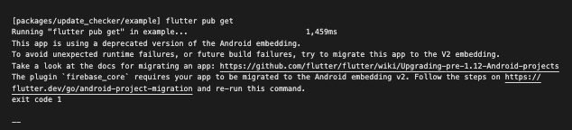

# Changes in all `firebase` packages

## New version numbers

- `firebase_core`: ^1.16.0 -> ^2.7.1
- `firebase_crashlytics`: ^2.7.2 -> ^3.0.17
- `firebase_messaging`: ^11.3.0 -> ^14.3.0
- `firebase_database`: ^7.2.2 -> ^10.0.16
- `firebase_app_check`: ^0.0.6+11 -> ^0.1.1+14

---

## Changes in `flutter_deriv_packages`:

After upgrading `firebase_core` we update `firebase_database` & `firebase_analytics` which changes the following packages:

- `update_checker`:

  - Updating `firebase_database` here causes an issue with Android embedding:

    

    The fix is straightforward, we will have to replace the reference to `FlutterApplication` in the application tag with `${applicationName}`.

    Previous configuration:

    ```xml
    <application
    android:name="io.flutter.app.FlutterApplication"
    >
    <!-- code omitted -->
    </application>
    ```

    New configuration:

    ```xml
    <application
    android:name="${applicationName}"
    >
    <!-- code omitted -->
    </application>
    ```

  - `packages/update_checker/lib/src/repositories/firebase_database.dart`:
    - Line 14: `reference()` to `ref()`.
    - Line 17: `.value` to `.snapshot.value`.

<br>

- `analytics`:

  - Updating `firebase_analytics` here causes an error in the file `packages/analytics/lib/analytics.dart`:

    - Line 27:

      ```dart
      /// Initialises the `Analytics`.
      /// Sets the device-token to `RudderStack`.
      /// bool [isEnabled] enables or disables "Analytics".
      Future<void> init({required bool isEnabled}) async {
          _firebaseAnalytics = FirebaseAnalytics();
          observer = AnalyticsRouteObserver(onNewRoute: _newRouteHandler);
          ...
      ```

      has to be changed to:

      ```dart
      /// Initialises the `Analytics`.
      /// Sets the device-token to `RudderStack`.
      /// bool [isEnabled] enables or disables "Analytics".
      Future<void> init({required bool isEnabled, required FirebaseApp firebaseApp}) async {
          _firebaseAnalytics = FirebaseAnalytics.instanceFor(app: firebaseApp,);
          observer = AnalyticsRouteObserver(onNewRoute: _newRouteHandler);
          ...
      ```

      This requires us to import `firebase_core` to analytics dependencies.

    - Line 108:
      ```dart
      /// Sets the user id to `Firebase`.
      Future<void> _setFirebaseUserId(String userId) =>
          _firebaseAnalytics.setUserId(userId);/// Sets the user id to `Firebase`.
      ```
      has to be changed to:
      ```dart
      /// Sets the user id to `Firebase`.
      Future<void> _setFirebaseUserId(String userId) =>
          _firebaseAnalytics.setUserId(id: userId);/// Sets the user id to `Firebase`.
      ```

---

## Changes in `flutter_multipliers`:

After changing the packages dependencies we have to make some changes in the `multipliers` source code.

- `main.dart`, line 242:

  ```dart
  await Analytics().init(isEnabled: true);
  ```

  should be changed to:

  ```dart
  await Analytics().init(isEnabled: true, firebaseApp: Firebase.app());
  ```

- `lib/features/market_info/states/about_market/about_market_service.dart` Line 16:

  ```dart
  @override
  Future<AboutMarketModel?> getMarketAboutDetails(String symbol) async {
      final DataSnapshot stringBanners = await FirebaseDatabase.instance
          .reference()
          .child('about_markets')
          .once();
  ```

  should be changed to:

  ```dart
  @override
  Future<AboutMarketModel?> getMarketAboutDetails(String symbol) async {
      final DatabaseReference dbRef =
          FirebaseDatabase.instance.ref().child('about_markets');

      final DataSnapshot stringBanners = (await dbRef.once()).snapshot;
  ```

- `lib/features/home_page/states/banner/home_page_banner_service.dart` Line 23:

  ```dart
    final DataSnapshot rawBanners = await firebaseDatabase
          .reference()
          .child('banners')
          .child(usersCountry)
          .once();

    for (final dynamic banner in rawBanners.value) {
        final BannerModel item =

        ...
  ```

  should be changed to:

  ```dart
    final DatabaseReference dbRef =
        firebaseDatabase.ref().child('banners').child(usersCountry);

        final DataSnapshot rawBanners = (await dbRef.once()).snapshot;

        for (final dynamic banner in rawBanners.value as List<dynamic>) {
            final BannerModel item =

        ...
  ```

- `lib/features/home_page/states/popular_market/popular_market_service.dart` Line 30:

  ```dart
    final DataSnapshot rawMarkets = await firebaseDatabase
          .reference()
          .child(_tryATradeDataBaseKey)
          .child(countryCode!)
          .once();

    if (rawMarkets.value != null) {
        for (final dynamic market in rawMarkets.value) {

        ...
  ```

  should be changed to:

  ```dart
    final DatabaseReference dbRef = firebaseDatabase
          .ref()
          .child('banners')
          .child(_tryATradeDataBaseKey)
          .child(countryCode!);

    final DataSnapshot rawMarkets = (await dbRef.once()).snapshot;

    if (rawMarkets.value != null) {
        for (final dynamic market in rawMarkets.value as List<dynamic>) {

        ...
  ```

- `lib/core/states/markets/firebase_markets_cubit.dart` Line 22:

  ```dart
    await FirebaseDatabase.instance
        .reference()
        .child(_trendingMarketsDataBaseKey)
        .child(countryCode)
        .once()
        .then<void>((DataSnapshot marketsSnapshot) {
        if (marketsSnapshot.value == null || marketsSnapshot.value.isEmpty) {
        _emitMarketsLoaded(firebaseMarketItems);
        } else {
            for (final dynamic rawMarketItem in marketsSnapshot.value) {
            final Map<String, dynamic> marketItemJson =
                Map<String, dynamic>.from(rawMarketItem);

            try {
                final MarketItemSubscription firebaseMarketItem =
                    allItems.firstWhere(
                (MarketItemSubscription item) =>
                    item.item.symbol == marketItemJson['asset'],
                );

                firebaseMarketItems.add(
                // We want tags only be shown on tending markets,
                // so only market items in trending markets list can have tag value.
                firebaseMarketItem.copyWith(
                    item: firebaseMarketItem.item.copyWith(
                    tag: marketItemJson['tag'],
                    ),
                ),
                );
            } on StateError catch (e) {
                dev.log('$FirebaseMarketsCubit fetchTrendingMarkets() error: $e');

                continue;
            }
            }
            _emitMarketsLoaded(firebaseMarketItems);
        }
    });
  ```

  should be changed to:

  ```dart
    await FirebaseDatabase.instance
        .ref()
        .child(_trendingMarketsDataBaseKey)
        .child(countryCode)
        .once()
        .then<void>((DatabaseEvent marketsEvent) {
      if (marketsEvent.snapshot.value == null ||
          (marketsEvent.snapshot.value as List<dynamic>).isEmpty) {
        _emitMarketsLoaded(firebaseMarketItems);
      } else {
        for (final dynamic rawMarketItem
            in marketsEvent.snapshot.value as List<dynamic>) {
          final Map<String, dynamic> marketItemJson =
              Map<String, dynamic>.from(rawMarketItem);

          try {
            final MarketItemSubscription firebaseMarketItem =
                allItems.firstWhere(
              (MarketItemSubscription item) =>
                  item.item.symbol == marketItemJson['asset'],
            );

            firebaseMarketItems.add(
              // We want tags only be shown on tending markets,
              // so only market items in trending markets list can have tag value.
              firebaseMarketItem.copyWith(
                item: firebaseMarketItem.item.copyWith(
                  tag: marketItemJson['tag'],
                ),
              ),
            );
          } on StateError catch (e) {
            dev.log('$FirebaseMarketsCubit fetchTrendingMarkets() error: $e');

            continue;
          }
        }
        _emitMarketsLoaded(firebaseMarketItems);
      }
    });
  ```

- `lib/core/helpers/deriv_auth_repository.dart` line 81:

  ```dart
   await Analytics().init(isEnabled: true);
  ```

  should be changed to:

  ```dart
    await Analytics().init(
      isEnabled: true,
      firebaseApp: Firebase.app(),
    );
  ```
